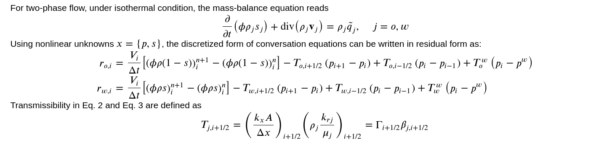

In reservoir simulation, the fully implicit method (FIM) is the state-of-the-art. The majority of commercial and academic simulators are successful because they are inherently stable due to the fact that the timestep is not restricted and is chosen for practical reasons; they also have no unexpected oscillations in the solution due to CFL violations; and they also have extremely efficient linear and nonlinear solver options.
On the other hand, the disadvantages include the fact that it requires a nonlinear solution with complete Jacobian construction, the nonlinear solution is not always convergent, and it can be computationally expensive if timesteps are not set carefully.

